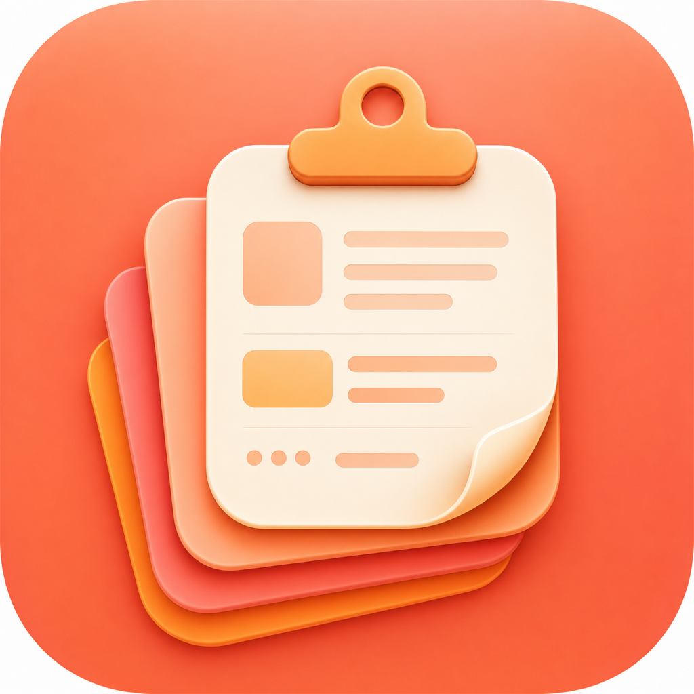
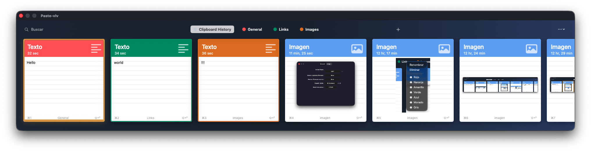
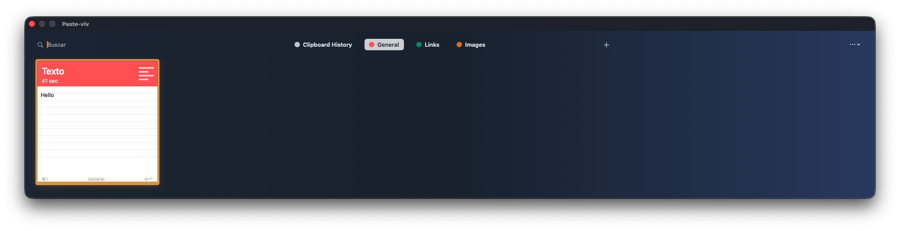
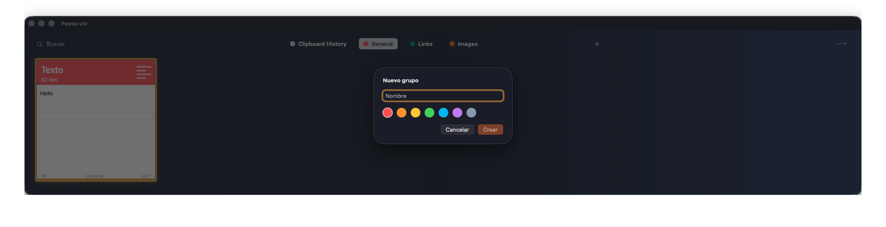
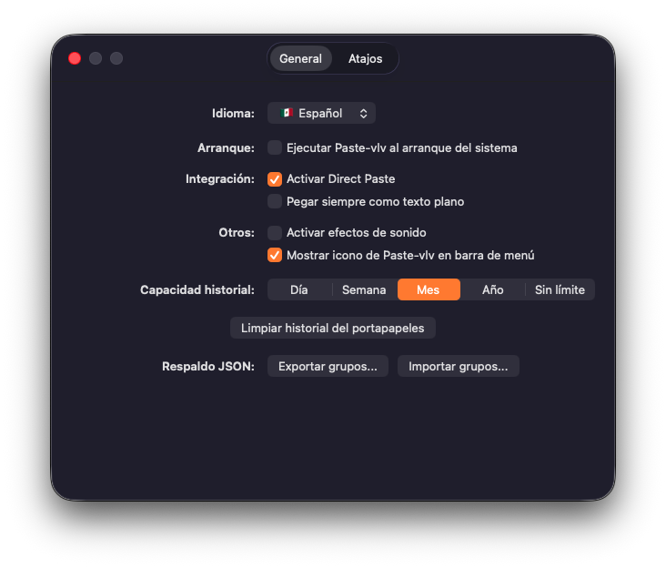
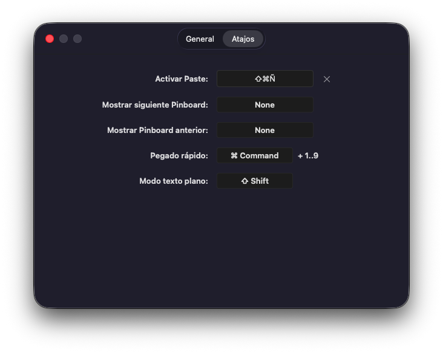

# Paste vlv

<p align="center">
  
</p>

<p align="center">
  <strong>A fast, local-first clipboard manager for macOS.</strong><br>
  Keep what you copy. Find it instantly. Paste it where you need it.
</p>

<p align="center">
  <a href="https://github.com/VlV-515/paste-vlv">View source</a>
  ·
  <a href="https://github.com/VlV-515/paste-vlv/releases">Releases</a>
  ·
  <a href="https://sourceforge.net/projects/paste-vlv/">SourceForge</a>
  ·
  <a href="#get-paste-vlv">Get it</a>
  ·
  <a href="#using-paste-vlv">How it works</a>
  ·
  <a href="#language">Languages</a>
  ·
  <a href="#backup-and-restore">Backups</a>
</p>

<p align="center">
  
  
  
  
  <a href="LICENSE"></a>
</p>



Paste vlv is a native Mac clipboard manager for people who copy all day. It lives in your menu bar, remembers copied text, links, images, and files locally, then brings them back in a wide, keyboard-friendly panel when you need them.

No account. No subscription. No server to sign into. Your clipboard history stays on your Mac.

## Why Paste vlv?

- **Keep your flow.** Open history from a global shortcut or the menu bar, search, choose, and paste without hunting through old windows.
- **Make useful things permanent.** Turn any item into a favorite, pin it, or send it to a color-coded pinboard.
- **Paste your way.** Paste directly into the app you were using, or copy the item back to the clipboard. Paste text as plain text when formatting would get in the way.
- **Stay in control.** Pause capture, choose how long history is kept, clear it when needed, and keep data on-device.
- **Use your language.** Paste vlv starts in English and can switch its interface to Spanish from Preferences.
- **Move your saved text.** Export pinboards as a portable, versioned JSON backup and restore them later.

## At a glance

| Paste vlv does | Paste vlv deliberately does not do |
| --- | --- |
| Captures text, links, images, and files from the macOS clipboard | Send clipboard data to a server or enable cloud sync today |
| Stores history locally in a Core Data store | Include a team workspace, shared pinboards, or collaboration features |
| Gives you pinboards, custom titles, favorites, pins, search, and quick paste | Replace a password manager or promise secure handling of secrets you copy |
| Exports grouped text pinboards to JSON | Export ungrouped history, links, images, or files to JSON |
| Runs as a native macOS menu-bar utility | Support iPhone, iPad, Windows, Linux, or web browsers |

> **Clipboard privacy note:** clipboard managers can see what you copy. Avoid copying passwords, recovery codes, and other sensitive secrets. Paste vlv keeps its current data locally, but it is not a password manager.

## Get Paste vlv

### Download v1.2.0

Download the latest release from [GitHub Releases](https://github.com/VlV-515/paste-vlv/releases).
SourceForge mirror files for v1.2.0 are prepared locally for upload.

The current binary is ad-hoc signed, not Developer ID signed, and not notarized.
macOS may show a Gatekeeper warning on first launch. Clean Gatekeeper
distribution requires a paid Apple Developer Program membership, Developer ID
signing, and notarization.

### Requirements

- macOS 13 Ventura or later
- Swift 5.9 or later (included with current Xcode or Command Line Tools)

### Download source

Download the project from [GitHub](https://github.com/VlV-515/paste-vlv), or clone it:

```sh
git clone https://github.com/VlV-515/paste-vlv.git
cd paste-vlv
```

### Build an app you can open

Create a release `.app` bundle, then launch it:

```sh
./scripts/package-app.sh
open "dist/Paste vlv.app"
```

The script builds a release version, creates `dist/Paste vlv.app`, writes its bundle metadata, and applies ad-hoc signing. `dist/` is generated locally and is intentionally not committed.

### Run from source instead

For development or a quick try, run the Swift Package directly:

```sh
swift run Paste-vlv
```

To confirm a checkout compiles without opening the app:

```sh
swift build
```

## First run: enable Direct Paste

Paste vlv works as a menu-bar app. Open it with the menu-bar icon or its default global shortcut, **Shift–Command–Ñ**. The shortcut can be changed in Preferences.

When **Direct Paste** is enabled, Paste vlv returns focus to the app you were using and sends the paste action there. macOS requires Accessibility permission for this:

1. Open **System Settings > Privacy & Security > Accessibility**.
2. Enable **Paste vlv**.
3. If macOS keeps requesting access, remove Paste vlv from that list, add `dist/Paste vlv.app` again, then restart the app.

Without Direct Paste, selecting an item still places it on the regular clipboard for you to paste normally.

> The packaged `.app` is recommended for Direct Paste testing because macOS ties Accessibility permission to the app bundle more reliably than to a process launched with `swift run`.

## Using Paste vlv

### Capture, search, and paste

Copy something in any app. Paste vlv watches the standard macOS clipboard and stores normalized text, links, images, and file references locally. Duplicate content is recognized, so copying the same thing again refreshes that item instead of flooding the history. Choosing a saved grouped card promotes it in Clipboard History without changing its group order, color, or source app.

Open the panel and start typing: search is focused automatically. Each opening starts in **Clipboard History**, so a pinboard is only shown after you select it. Results match copied content, preview text, URLs, and the source app name.



| Action | Shortcut or gesture |
| --- | --- |
| Open or hide Paste vlv | Configurable global shortcut; default `Shift-Command-Ñ` |
| Move through cards | `←` / `→` |
| Paste selected card | `Return` |
| Paste selected text as plain text | `Shift-Return` |
| Quick-paste one of the first nine cards | `Command-1` through `Command-9` |
| Paste a card with the mouse | Double-click it |
| Select all cards in current group/history | `⌘A` |
| Delete selected card(s) | `Forward Delete` |
| Close the panel | Click another app/window or use the panel menu |

Cards use Paste-inspired dark surfaces, strong source-app headers, rounded corners, and macOS app icons. File cards keep a single-file thumbnail/path or a compact multi-file presentation; URL cards load a local rich preview when metadata is available. Drag across cards to select several items before deleting them. Each card also has a contextual menu for paste, plain-text paste, favorite, pin, moving between groups, renaming, and deletion. Double-click its title to edit it inline; press `Return` to save.

### Organize with pinboards

Pinboards are color-coded spaces for the things you want to reuse: snippets, project links, visual references, or any copied item. Create one with the `+` button, choose a name and color, then drag a card onto it or use the card’s **Move to group** menu. Drag a pinboard chip onto another chip to reorder the group tabs.



You can rename a pinboard, change its color, or delete it from its contextual menu. Deleting a pinboard does **not** delete its cards; it returns them to general history.

Deleting a card from **Clipboard History** removes it permanently only when it has no group. A grouped card is removed from History while its group copy stays intact. Delete it from inside its group to remove it permanently. Paste vlv asks for confirmation before deleting cards, groups, or clearing history.

### Tune the behavior

Preferences let you make Paste vlv feel at home on your Mac:

- Choose interface language: **🇺🇸 English** (default) or **🇲🇽 Español**
- Launch at login
- Enable or disable Direct Paste
- Paste as plain text by default
- Turn sound effects on or off
- Show or hide the menu-bar icon
- Pause or resume clipboard capture
- Keep history for 1 day, 1 week, 1 month, 1 year, or forever
- Clear all clipboard history
- Change the global activation shortcut





### Language

Paste vlv opens in English by default. Go to **Preferences > General > Language** and choose **🇺🇸 English** or **🇲🇽 Español**. The selection is saved locally and immediately updates the panel, Preferences, menu-bar menu, dialogs, and newly created starter pinboards. Existing pinboard names are your content and are never renamed when you change languages.

## Backup and restore

Paste vlv’s backup format is intentionally focused: it preserves the reusable text you organized, without producing giant archives full of screenshots and temporary clipboard noise.

### Export

Use **Export groups…** from any of these places:

- Menu-bar menu
- Panel `…` menu
- Preferences > General > JSON Backup

The saved filename looks like `paste-vlv-groups-YYYY-MM-DD-HH-mm-ss.json`. It is a pretty-printed, versioned JSON archive (current schema: `3`) containing:

- Pinboards: stable IDs, names, colors, order, and creation dates
- **Grouped text items only**: optional custom title, text, preview and search fields, source-app metadata, favorites, pins, group assignment, dates, and content hashes
- Export metadata: app name, bundle identifier, platform, and timestamp

### What backup intentionally leaves out

- General history items not assigned to a pinboard
- Links, images, and files, even when assigned to a pinboard

This keeps the JSON portable and reasonably small. The app shows an export summary with the number of omitted items so there are no surprises.

### Import

Choose **Import groups…** from the same menus and select a Paste vlv JSON archive. Import accepts schemas `2` and `3`, validates IDs, group assignments, referenced pinboards, and item types before changing local data. Matching IDs are updated; missing ones are created. The completion message reports both counts.

## Data, privacy, and sync

- Clipboard items and pinboards persist locally in a Core Data SQLite store.
- Captured images are stored locally in Application Support and referenced by the history store.
- CloudKit is deliberately disabled. The storage layer is prepared for a future opt-in sync path, but no iCloud container, entitlements, account, or cross-Mac sync is active.
- Capture can be paused at any time. The current implementation also has an internal per-app exclusion setting; a user-facing list for managing exclusions is not available yet.

## Project notes

Paste vlv is a personal, native macOS project built with Swift Package Manager, AppKit, SwiftUI, Core Data, `NSPasteboard`, Carbon global hotkeys, and macOS accessibility APIs.

Want the technical map? Read [Architecture](docs/ARCHITECTURE.md). Need the full command reference? Read [Commands](docs/commands.md). Publishing a version? Read [Release Guide](docs/release.md).

## Contributing and status

This is an active personal project. Bug reports, ideas, and respectful feedback are welcome through [GitHub Issues](https://github.com/VlV-515/paste-vlv/issues).

Current boundaries are intentional: Mac-only, local-only, no CloudKit sync, no shared workspaces, no OCR, and no mobile app. Those constraints keep Paste vlv focused, fast, and private by default.

## License

Copyright (c) 2026 VlV.

Paste vlv is free and open source under the [MIT License](LICENSE). You may use, copy, modify, distribute, and include it in other projects under that license's terms. See [LICENSE](LICENSE) for the complete text.
